## FINAL PROJECT REPORT

#### PHASE 1 - INSTALL LARAVEL

**Before we start, make sure you had installed xampp and composer first.**

1. Install XAMPP

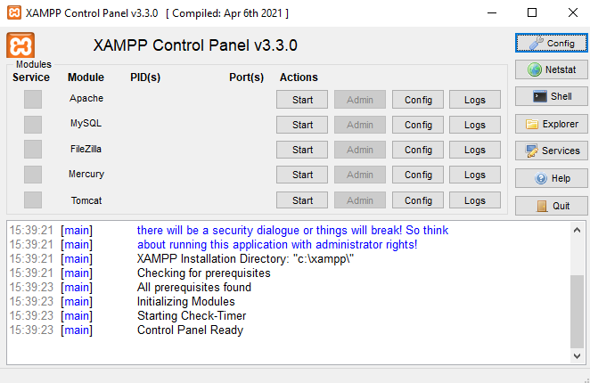


2. Install Composer

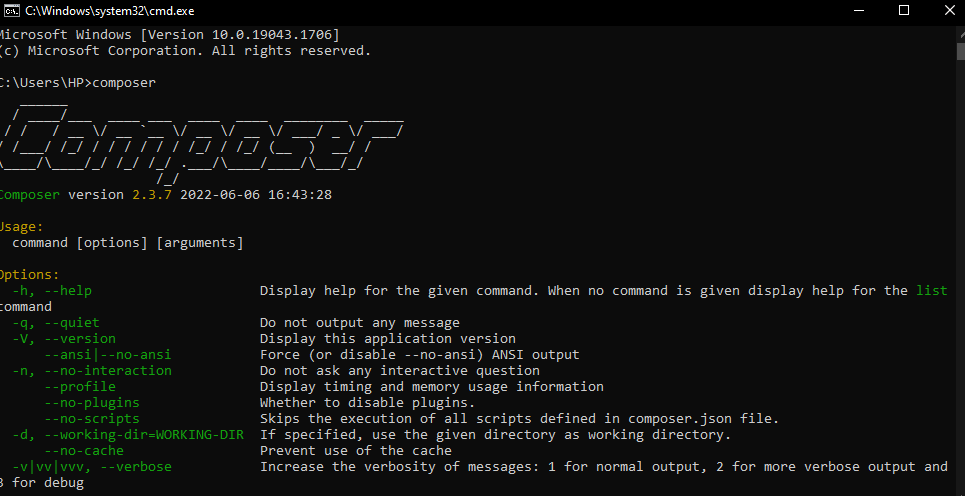


3. Go to command prompt ( windows + r then type cmd), change directory to /xampp/htdocs.

```markdown
cd \xampp\htdocs
```

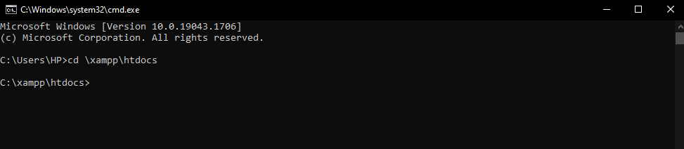


4. Do laravel installation with this command and wait until the progress is finished.

```markdown
composer create-project --prefer-dist laravel/laravel integratif
```

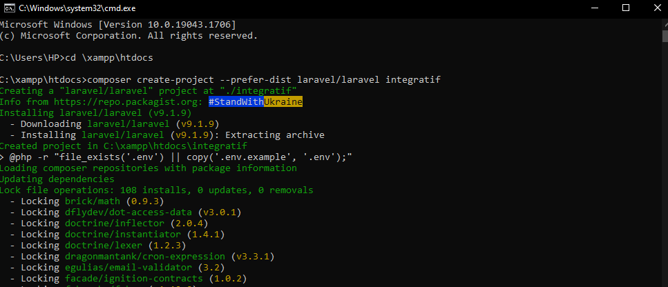


5. After that, check your Laravel installation in File Explorer. 

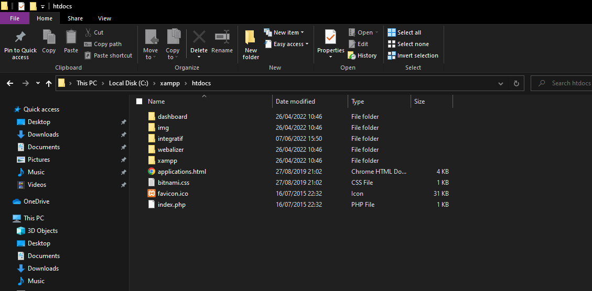


6. Change directory to integratif to check the installation via browser. There's a link that will direct you to browser and show Laravel homepage.

```markdown
cd integratif
php artisan serve
```

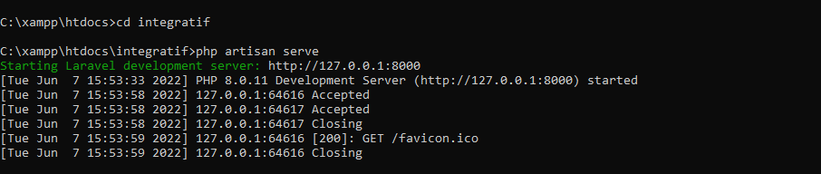

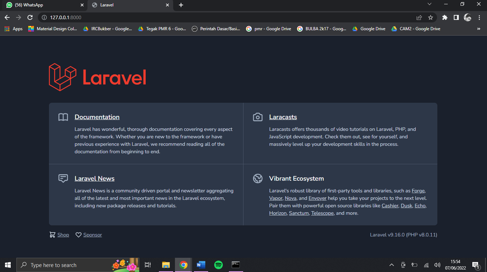


7. The installation is complete!


#### PHASE 2 - DATABASE AND RSS

1. Change DB_DATABASE in file .env. according to phpmyadmin.

   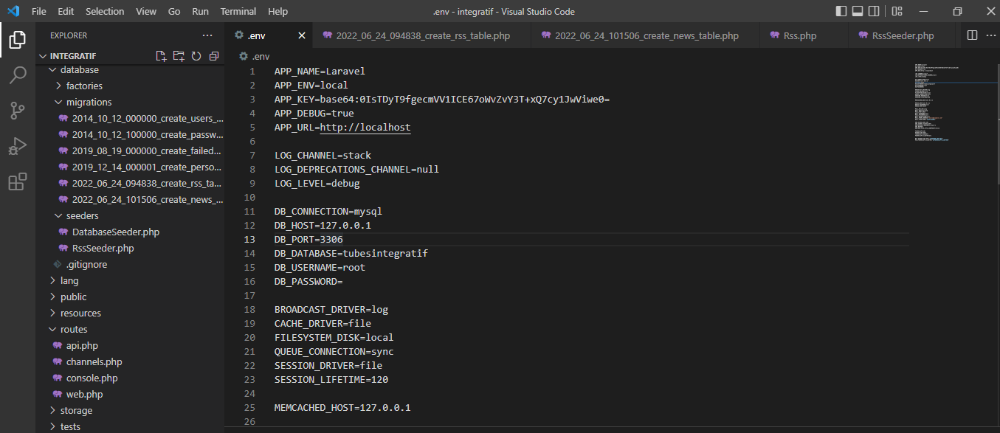


2. Create file for rss table and news table.

   ```markdown
   php artisan make:migration create_rss_table
   php artisan make:migration create_news_table
   
   ```

   

3. Create seeder and controller.

   ```markdown
   php artisan make:model Rss -seed --controller
   ```


4. Create news controller.

   ```markdown
   php artisan make:model News --controller
   ```


5. Edit file NewsController.php

   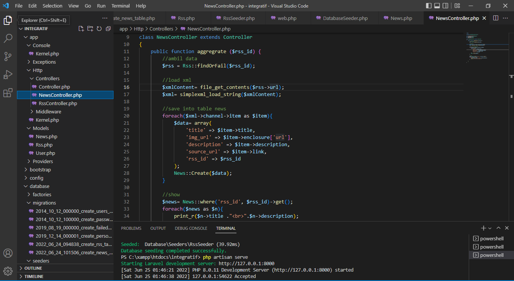


6. Add Route in routes/web.php

   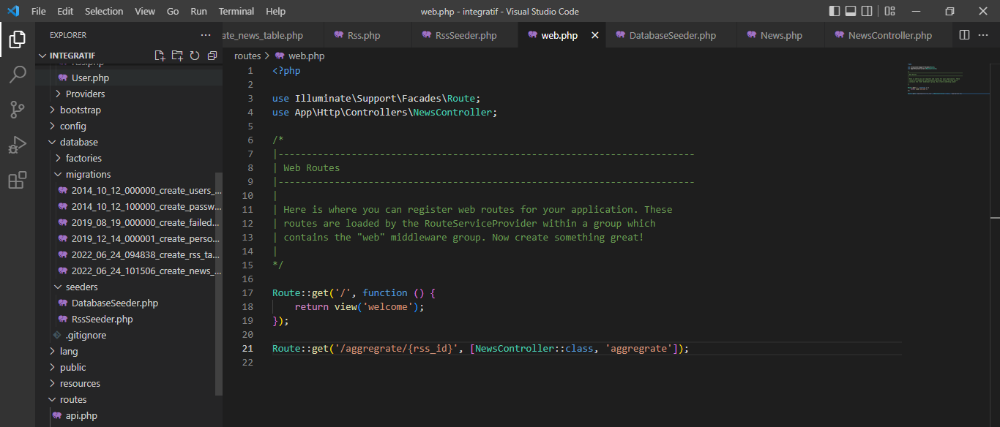

   

7. Run migration:fresh, db:seed, and artisan serve

```markdown
php artisan migrate:fresh
php artisan db:seed
php artisan serve
```


8. Check on database phpmyadmin

   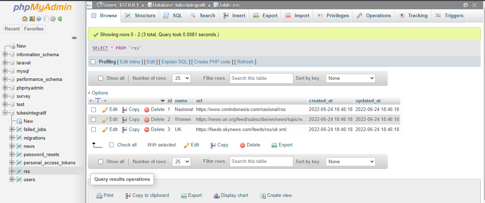


9. Check on your browser

   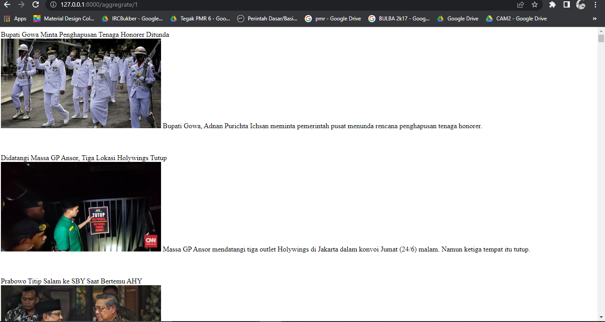


#### PHASE 3 - HOMEPAGE

In this page, news from the following RSS link is displayed:

Health: https://news.un.org/feed/subscribe/en/news/topic/health/feed/rss.xml

Asia: https://news.un.org/feed/subscribe/en/news/region/asia-pacific/feed/rss.xml

Europe: https://news.un.org/feed/subscribe/en/news/region/europe/feed/rss.xml

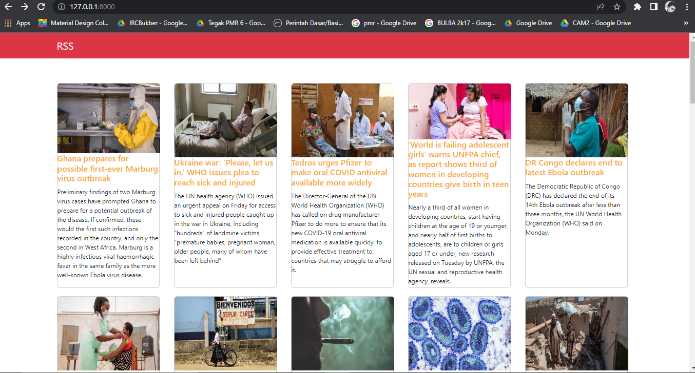
