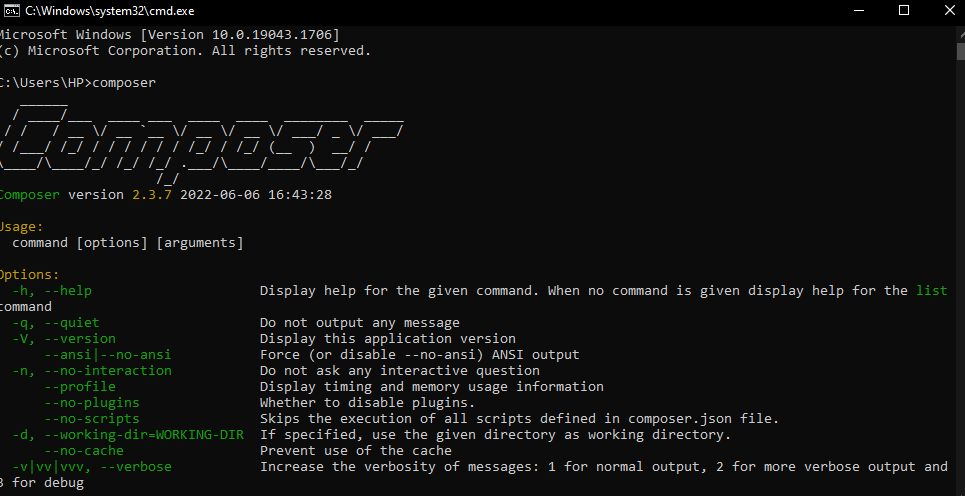
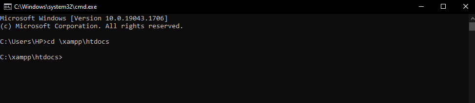
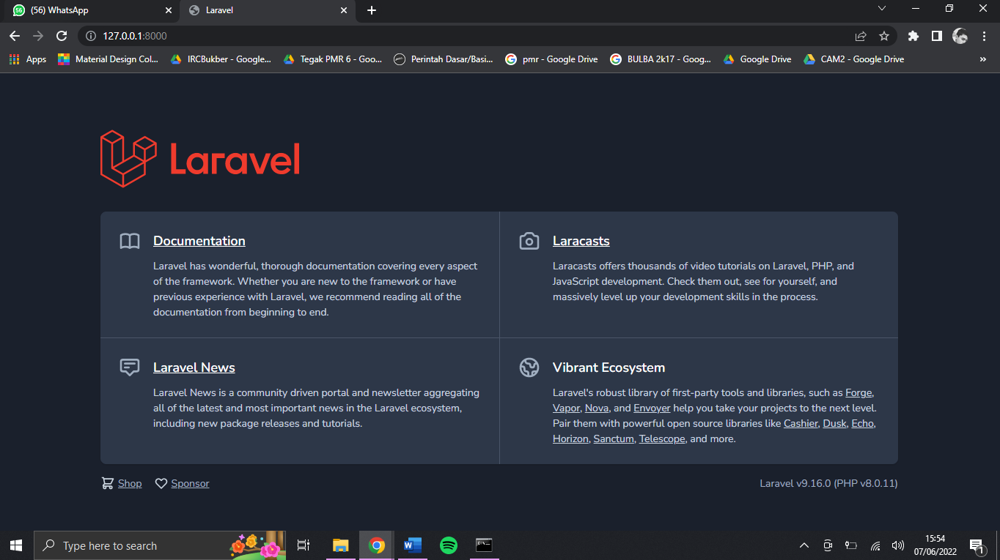

## FINAL PROJECT - PHASE 1

#### Install Laravel

**Before we start, make sure you had installed xampp and composer first.**

1. Install XAMPP


2. Install Composer




3. Go to command prompt ( windows + r then type cmd), change directory to /xampp/htdocs.

```markdown
cd \xampp\htdocs
```




4. Do laravel installation with this command and wait until the instalation is complete.

```markdown
composer create-project --prefer-dist laravel/laravel integratif
```


5. After that, check your Laravel installation in File Explorer. 


6. Change directory to integratif to check the installation via browser. There's a link that will direct you to browser and show Laravel homepage.

```markdown
cd integratif
php artisan serve
```



